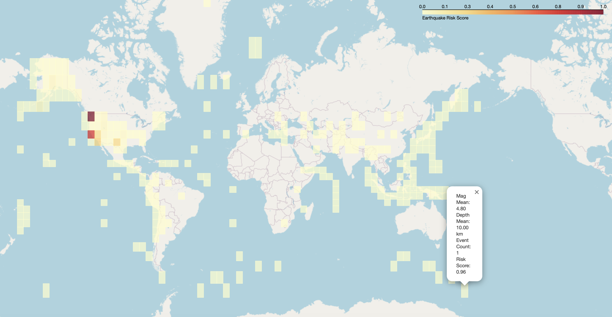

# Earthquake-risk-mapping
A geospatial data science project to analyse and visualise earthquake risk using historical USGS data.

# 🌍 Earthquake Risk Mapping

This project aims to explore, visualize, and analyze earthquake risk using geospatial data science techniques. It is built as a demonstration of practical data science skills—particularly geospatial analysis, data visualization, and exploratory data analysis (EDA)—and was developed as part of a technical presentation for a Data Scientist position at Datarock.

---

## 📌 Objectives

- Explore global earthquake data from authoritative sources (e.g., USGS)
- Perform geospatial analysis using `GeoPandas`, `Folium`, and `Matplotlib`
- Generate interactive risk maps and static plots
- Analyze frequency, magnitude, depth, and location-based clustering of earthquakes

---

## 🛠️ Tech Stack / Tools Used

| Tool / Library | Purpose |
|----------------|---------|
| `Python 3.9` | Core programming language |
| `Pandas` | Data wrangling and analysis |
| `GeoPandas` | Geospatial data processing |
| `Folium` | Interactive mapping |
| `Matplotlib` / `Seaborn` | Static visualizations |
| `scikit-learn` | Clustering or modeling |
| `Jupyter Notebook` | Interactive analysis & demonstration |
| `conda` | Environment and dependency management |

---

## 📁 Project Structure

```plaintext
earthquake-risk-mapping/
│
├── notebooks/
│   ├── 01_data_exploration.ipynb        # EDA & visualization
│   └── 02_feature_engineering_and_modeling.ipynb      # Classification and predictions
│   └── 03_visualization_and_mapping.ipynb      # Feature identification
│   └── 04_risk_scoring_and_conclusion.ipynb     # Generation of a risk map
│
├── data/
│   └── earthquake_data.csv             # Earthquake dataset
│   └── cleaned_earthquake_data.csv     # Cleaned Earthquake dataset
│
├── environment.yml                      # Conda environment definition
├── .gitignore
└── README.md                            # This file

🚀 Getting Started
1️⃣ Clone the Repository

git clone https://github.com/Prasanna2989/earthquake-risk-mapping.git
cd earthquake-risk-mapping


2️⃣ Set Up the Conda Environment
conda env create -f environment.yml
conda activate earthquake-risk

3️⃣ Launch the Notebook
jupyter notebook

Open 01_data_exploration.ipynb in your browser and run through the cells.

📸 Screenshots





